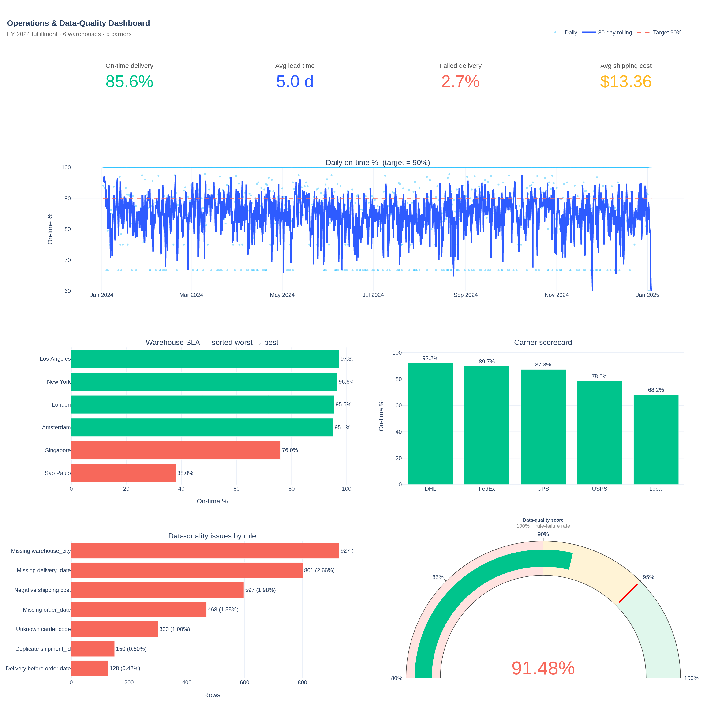

# Data Analytics Portfolio

End-to-end analytics projects covering **sales performance, customer retention, and operations & data quality** — built from raw datasets to executive dashboards. Each project ships with the SQL schema, the analysis notebook, an interactive dashboard, and a written executive report.

The aim is to demonstrate the full job of a Data / BI Analyst:

> *Take messy operational data → clean and model it → define the right KPIs → build a dashboard the business can actually use → write up insights and recommendations leadership can act on.*

---

## Skills demonstrated

- **SQL** — modeling, window functions, cohort analysis, rolling aggregations, data-quality rules
- **Python** — `pandas` for cleaning & analysis, reproducible notebooks, synthetic data generation
- **Visualisation** — Plotly dashboards with KPI cards, cohort heatmaps, funnels, gauges
- **Analytical thinking** — KPI design, segmentation (RFM), cohort retention, bottleneck attribution, Pareto analysis
- **Storytelling** — executive-ready reports with headline numbers, findings, and recommendations
- **Engineering hygiene** — versioned scripts, deterministic seeds, schema files, documented cleaning pipelines

---

## Tools used

| Layer            | Tools                                                                |
| ---------------- | -------------------------------------------------------------------- |
| Data engineering | Python (`pandas`, `numpy`), SQL (PostgreSQL dialect)                 |
| Analysis         | Jupyter notebooks                                                    |
| Visualisation    | Plotly (single-file interactive HTML dashboards)                     |
| Reporting        | Markdown + embedded screenshots                                      |

> Plotly was chosen over Power BI / Tableau so the dashboards are reproducible from source on any machine without a license. The dashboard layouts mirror what a Power BI page would look like and can be re-skinned in either tool.

---

## Projects

### 1. Sales Performance Analytics &nbsp;→&nbsp; [`project_1_sales_analysis/`](./project_1_sales_analysis)

Two years of multi-channel e-commerce orders (26k orders, 80k order lines, $132M revenue). Builds the executive sales view: revenue trends, category & product performance, regional breakdown, top-customer concentration, and a session→purchase funnel by channel.

**Highlights**
- Star-schema model in 5 tables, fully populated CSVs
- KPIs: net revenue, gross margin, AOV, return rate, YoY growth
- Funnel conversion analysis by channel (Web, Mobile, Marketplace, Retail)
- Pareto check on customer concentration
- Recommendations sized in dollars

📄 **[Full report →](./project_1_sales_analysis/report.md)**
&nbsp;&nbsp;📊 [Interactive dashboard](./project_1_sales_analysis/dashboard/sales_dashboard.html)


---

### 2. Customer Behavior & Retention &nbsp;→&nbsp; [`project_2_customer_analytics/`](./project_2_customer_analytics)

Three years of subscription transactions (5.6k customers, 48k billing events). Builds the retention view that growth and customer-success teams actually use: cohort retention, monthly churn, LTV by acquisition channel and plan, and an RFM-lite segmentation.

**Highlights**
- Cohort retention heatmap (signup month × months since signup)
- Monthly churn trend
- LTV split by channel and by plan
- RFM-lite segmentation: Champions, Promising, Loyal, At Risk, Lost
- Recommendations on onboarding, upsell, and channel mix

📄 **[Full report →](./project_2_customer_analytics/report.md)**
&nbsp;&nbsp;📊 [Interactive dashboard](./project_2_customer_analytics/dashboard/customer_dashboard.html)


---

### 3. Operations Efficiency & Data Quality &nbsp;→&nbsp; [`project_3_operations_analytics/`](./project_3_operations_analytics)

A year of fulfillment data (30k shipments, 6 warehouses, 5 carriers) against a 7-day promised SLA, paired with a deliberately messy upstream feed for a data-quality scorecard. Diagnoses where the SLA is breaking and quantifies trust in the data.

**Highlights**
- Warehouse and carrier SLA scorecards
- Bottleneck attribution: processing vs. transit
- Daily on-time % with 30-day rolling average and 90% target line
- DQ rule library covering completeness, validity, uniqueness, referential integrity
- Single-row DQ score for alerting

📄 **[Full report →](./project_3_operations_analytics/report.md)**
&nbsp;&nbsp;📊 [Interactive dashboard](./project_3_operations_analytics/dashboard/operations_dashboard.html)



---

## Repository layout

```
data-analytics-portfolio/
│
├── README.md                         # ← you are here
├── requirements.txt
├── Makefile
│
├── project_1_sales_analysis/
│   ├── data/                         # generated CSVs
│   ├── notebooks/                    # Jupyter analysis
│   ├── sql/                          # schema + KPI queries
│   ├── dashboard/                    # interactive HTML + builder script
│   ├── scripts/                      # synthetic-data generator
│   └── report.md                     # executive write-up
│
├── project_2_customer_analytics/     # same structure
├── project_3_operations_analytics/   # same structure
│
└── assets/
    └── dashboard_screenshots/        # PNGs for the README
```

---

## How to run everything

```bash
# 1. Install dependencies
pip install -r requirements.txt

# 2. Generate the data, run the notebooks, build the dashboards
make all
```

Or one project at a time:

```bash
make project1     # sales
make project2     # customer
make project3     # operations
```

---

## About the data

Every dataset is **synthetic** — generated by `scripts/generate_data.py` in each project — so the repo is fully reproducible without proprietary data. The schemas, distributions, and seasonality patterns are designed to mirror what a real e-commerce / SaaS / fulfillment analyst encounters: realistic skews, foreign-key relationships, embedded data-quality issues, time-of-year effects.

Random seeds are pinned, so re-running the pipeline produces identical output.

---

## Author

Built as a portfolio for Data / BI Analyst applications. Available for full-time and contract work.
