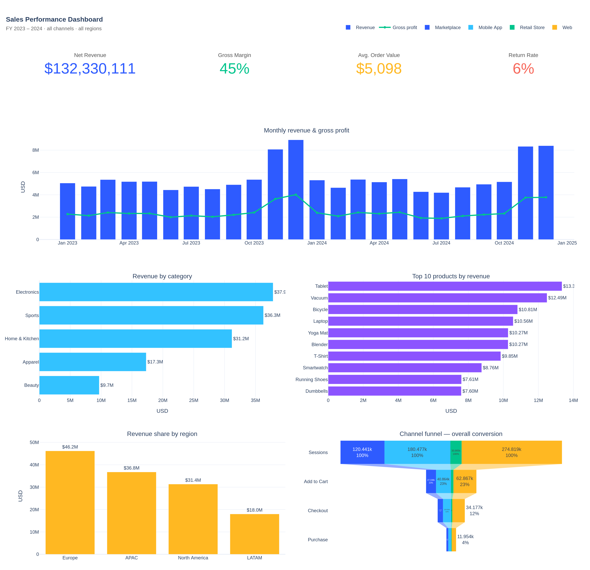

# Project 1 — Sales Performance Analysis

> **Audience:** Commercial leadership (VP Sales, Head of E-commerce, CFO).
> **Period covered:** Jan 2023 – Dec 2024 (24 months, multi-channel).
> **Data:** 26k orders, 80k order lines, 5k customers, 20 SKUs across 5 categories and 4 regions.

---

## 1. Business problem

Sales leadership needs a single source of truth for **how the business is performing, where the growth is coming from, and where margin is being lost**. The previous reporting was fragmented across spreadsheets exported from Shopify, Stripe, and the warehouse — numbers rarely tied. This project consolidates the order data into a star schema, defines a stable KPI layer, and ships an executive dashboard that can be refreshed on demand.

The questions the dashboard must answer:

1. Are we growing — and is the growth profitable?
2. Which categories and products are driving (or dragging) results?
3. Which regions and customer segments are over- and under-indexing?
4. Where are we losing visitors in the conversion funnel, and on which channel?

---

## 2. Data description

A typical e-commerce star schema. CSVs live in `data/`; the schema (`sql/01_schema.sql`) maps directly onto Postgres / Snowflake / BigQuery.

| Table          | Grain            | Rows   | Notes                                     |
| -------------- | ---------------- | ------ | ----------------------------------------- |
| `customers`    | 1 per customer   | 5,000  | Region, country, segment, signup date     |
| `products`     | 1 per SKU        | 20     | Category, unit cost, unit price           |
| `orders`       | 1 per order      | 26,479 | Channel, status (Completed/Returned/Cancelled) |
| `order_items`  | 1 per order line | 79,670 | Quantity, gross revenue, gross profit     |
| `daily_funnel` | day × channel    | 2,793  | Sessions → Add-to-cart → Checkout → Purchase |

**Cleaning steps applied** (see `notebooks/01_sales_analysis.ipynb`): referential-integrity checks across the four FK joins, duplicate-key checks, exclusion of `Cancelled` orders from revenue (kept for funnel/return rate), and a coalesced calendar dimension for trend analysis.

---

## 3. KPI definitions

| KPI               | Definition                                                                 | Why it matters                                                          |
| ----------------- | -------------------------------------------------------------------------- | ----------------------------------------------------------------------- |
| **Net revenue**   | Σ `gross_revenue` of order lines where `status != 'Cancelled'`             | Top-line growth, the headline number to leadership                      |
| **Gross profit**  | Σ `gross_revenue − cost`                                                   | Profitability after COGS, before opex                                   |
| **Gross margin %**| `gross_profit / gross_revenue`                                             | Mix-quality signal; flags discounting or category drift                 |
| **AOV**           | Mean of order-level revenue (Completed only)                               | Basket size; reflects merchandising and bundling                        |
| **Return rate %** | `Returned orders / All orders`                                             | Operational and product-quality signal                                  |
| **Conversion %**  | `Purchases / Sessions` per channel                                         | Funnel health by channel — informs paid-media spend                     |
| **YoY growth %**  | (current month − same month last year) / same month last year              | True comparable growth, free of seasonality                             |

---

## 4. Headline results (FY 2023 + FY 2024)

| KPI               | Value           |
| ----------------- | --------------- |
| Net revenue       | **$132.3M**     |
| Gross profit      | **$59.5M**      |
| Gross margin      | **45.0%**       |
| Average order value | **$5,098**    |
| Orders            | **25,955**      |
| Active customers  | **4,974**       |
| Return rate       | **5.9%**        |



The interactive HTML version is at `dashboard/sales_dashboard.html`.

---

## 5. Key findings

### Finding 1 — Holiday seasonality is the single biggest revenue driver
November + December accounted for **$33.7M (25.5%)** of the two-year total despite being only 8 of 24 months. December 2024 ($8.4M) was 60% above the trailing-quarter average. Forecasting and inventory plans need to anticipate a 1.5–1.7× lift in Q4.

### Finding 2 — Category mix is healthy at the top, thin at the bottom
Electronics ($37.9M, 28.6%) and Sports ($36.3M, 27.4%) together drive **56% of revenue**. Beauty, by contrast, contributes only **7.3%** despite carrying products at the same price points. The Beauty assortment (3 SKUs) is roughly half the depth of the other categories — an obvious place to invest in expansion.

### Finding 3 — Europe is over-indexing
Europe is **35% of revenue** but only **35%** of active customers — neutral on a per-customer basis — yet APAC and LATAM together hold **42%** of customers and produce **41%** of revenue. **North America is under-monetized**: 24% of customers but the same 24% revenue share, and the lowest customer count (1,179) of the top three regions. This is a market with clear room for paid acquisition.

### Finding 4 — Top-customer concentration is moderate
The **top 10% of customers contribute 20% of revenue**, and the top 20% contribute 36%. This is a healthy distribution — not Pareto-extreme — meaning the business is not single-account-dependent, but a structured loyalty/VIP program could lift revenue from the top decile materially.

### Finding 5 — Conversion is identical across channels — funnel is the lever
Every channel converts at **4.3–4.4% sessions → purchases**. The bottleneck is consistent: only **~22% of sessions add to cart** and roughly **half of those make it to checkout**. The bigger absolute opportunity is the Web channel (275k sessions); a 1pp lift to add-to-cart on Web alone would generate ~700 incremental orders, ~$3.5M in revenue at current AOV.

### Finding 6 — Return rate is contained but not zero
Overall return rate sits at **5.9%**, with no obvious category outlier in the synthetic data. This is a healthy baseline; the metric should be monitored monthly with category and SKU drilldowns added before a target is set.

---

## 6. Recommendations

1. **Expand the Beauty assortment.** Current depth (3 SKUs) limits ceiling. Test 4–6 new SKUs in Q1 with a target of doubling category contribution to ~14% by year-end.
2. **Run a North America paid-acquisition push.** Region has the smallest customer base of the top three but matches their per-customer revenue. Allocate incremental marketing dollars and measure CAC vs. LTV (see Project 2 cohorts).
3. **Optimize the Web add-to-cart step.** It is the single lowest-effort, highest-volume conversion lever. Test PDP layout, social proof, and stock urgency. Target +1pp lift in 90 days.
4. **Build a Q4 plan, not a Q4 reaction.** Inventory, paid media, and headcount should size to a 1.5× lift starting Oct 1, with a dashboard alert if YoY growth in week 1 of November falls below +20%.
5. **Launch a VIP program for the top decile.** Even a modest 5% revenue lift on the top 10% of customers is worth ~$1.3M annually at current run-rate.
6. **Make this dashboard the weekly trading review.** Net revenue, margin, AOV, return rate, and channel conversion at the top of every Monday meeting.

---

## 7. How to reproduce

```bash
# 1. Generate the data
python project_1_sales_analysis/scripts/generate_data.py
# 2. (Optional) Load into Postgres
psql -f project_1_sales_analysis/sql/01_schema.sql
# 3. Run the analysis
jupyter notebook project_1_sales_analysis/notebooks/01_sales_analysis.ipynb
# 4. Build the dashboard
python project_1_sales_analysis/dashboard/build_dashboard.py
```
