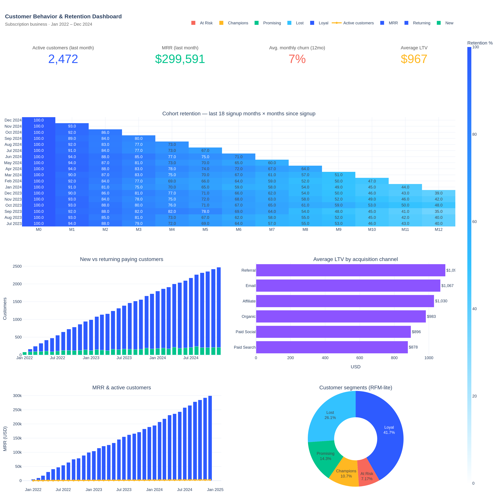

# Project 2 — Customer Behavior & Retention

> **Audience:** Growth, Product, and Customer Success leadership.
> **Period covered:** Jan 2022 – Dec 2024 (36 months).
> **Data:** 5,579 customers, 48,154 monthly subscription events across 4 plans, 6 acquisition channels, 10 countries.

---

## 1. Business problem

For a subscription business, the question is never just "did revenue go up?" — it's "*who's staying, who's leaving, and what is each customer worth?*". Headline MRR can grow even while retention rots underneath; channel ROI looks fine until you split LTV by channel and discover the volume source is also the cheapest customer.

This project answers four operational questions:

1. **How well does each cohort retain over time?** (Cohort heatmap)
2. **What is our true monthly churn rate, and is it improving?**
3. **What is LTV per customer, and how does it differ by channel and plan?**
4. **Which customer segments deserve which kind of attention?**

The deliverables — a refreshable cohort heatmap, an LTV-by-channel view, and an RFM-lite segmentation — give Growth a single place to size the gap between acquisition cost and lifetime value, and give CS a prioritized list of accounts to save.

---

## 2. Data description

| Table          | Grain                        | Rows    | Notes                                              |
| -------------- | ---------------------------- | ------- | -------------------------------------------------- |
| `customers`    | 1 per customer               | 5,579   | Plan, monthly price, signup date, country, channel |
| `transactions` | 1 per monthly billing event  | 48,154  | Subscription + occasional add-on revenue           |

**Cleaning steps applied:** validation that every transaction has a matching customer, conversion of dates to month-truncated periods for cohort math, exclusion of duplicate billing events on the same `(customer_id, month)`.

---

## 3. KPI definitions

| KPI                | Definition                                                                 | Why it matters                                          |
| ------------------ | -------------------------------------------------------------------------- | ------------------------------------------------------- |
| **MRR**            | Sum of `amount` in the most recent calendar month                          | Recurring revenue baseline                              |
| **Active customers** | Unique customers with a paid event in the month                          | Engagement baseline                                     |
| **Monthly churn %** | Customers active in M-1 with no payment in M / customers active in M-1   | Most actionable retention signal                        |
| **Cohort retention %** | Active customers in month *m* since signup ÷ original cohort size       | Diagnoses *when* customers leave, not just *how many*   |
| **LTV**            | Total revenue per customer (lifetime)                                      | Core unit-economics number for paid-acquisition payback |
| **RFM segment**    | Tertile of Recency, Frequency, Monetary mapped to a readable label         | Targeting and CS triage                                 |

---

## 4. Headline results

| KPI                          | Value          |
| ---------------------------- | -------------- |
| Total revenue (3 yr)         | **$5.39M**     |
| MRR (Dec 2024)               | **$300K**      |
| Active customers (Dec 2024)  | **2,472**      |
| Average LTV                  | **$967**       |
| Median LTV                   | **$263**       |
| Avg. monthly churn (12 mo)   | **6.7%**       |
| Latest month churn           | **6.5%**       |



The interactive HTML version is at `dashboard/customer_dashboard.html`.

---

## 5. Key findings

### Finding 1 — Retention drops sharply in the first quarter
The average retention curve across 36 cohorts:

| Months since signup | Avg retention |
| -------------------:| -------------:|
| 1                   | 92%           |
| 3                   | 80%           |
| 6                   | 65%           |
| 12                  | 41%           |

Roughly **one in five customers churns by month 3**, and only **two in five remain at month 12**. The shape of the curve — steepest in months 1-3 then flattening — is consistent with an *onboarding* problem, not a long-term value problem.

### Finding 2 — Plan tier is the dominant LTV lever
Average LTV by plan:

| Plan       | Avg LTV  | Customers |
| ---------- | --------:| ---------:|
| Enterprise | **$7,322** | 293     |
| Business   | **$2,234** | 862     |
| Pro        | **$503**   | 1,654   |
| Starter    | **$177**   | 2,770   |

Enterprise customers are worth **41× a Starter** in lifetime revenue, even though there are only ~10% as many. Anything that nudges Starter→Pro or Pro→Business compounds far harder than acquiring more Starters.

### Finding 3 — Acquisition channel ROI is inverted vs. spend
Average LTV by channel:

| Channel       | Avg LTV  | Customers |
| ------------- | --------:| ---------:|
| Referral      | **$1,095** | 608     |
| Email         | **$1,067** | 593     |
| Affiliate     | **$1,030** | 397     |
| Organic       | **$983**   | 1,634   |
| Paid Social   | **$896**   | 961     |
| Paid Search   | **$878**   | 1,386   |

Paid Search and Paid Social — the two highest-spend channels — produce the **lowest LTV** customers (-10% to -20% vs. Referral). Referral and Email customers are worth **+13%** more than the company average. Paid spend is buying volume, not value.

### Finding 4 — Churn is stable but elevated
Monthly churn has hovered around **6-7%** for the trailing 12 months with no clear improvement trend. At a 6.7% monthly rate, expected lifetime is ~15 months — short of the 24-month payback window typical for B2B SaaS. Reducing churn by even 1pp would extend expected lifetime by ~3 months, lifting average LTV by ~20%.

### Finding 5 — Customer base is concentrated in a "Loyal" middle, not a "Champions" head
RFM-lite distribution skews to "Loyal" (active, mid-frequency, mid-spend) with a thinner Champions tail. The "At Risk" segment (recent disengagement, prior heavy use) is the highest-value target for CS outreach: small in count, large in residual revenue.

---

## 6. Recommendations

1. **Fix month 1-3 onboarding.** The biggest retention drop happens before customers see steady-state value. Test a 30/60/90-day in-app activation program; instrument it so its effect on month-3 retention is measurable.
2. **Shift paid budget toward referral and email programs.** Referral customers are worth 13% more and cost a fraction of paid search. A formal referral incentive likely pays back inside one quarter.
3. **Prioritize plan upsell, not new logos.** A 5pp Starter→Pro upgrade rate moves more revenue than a 10% lift in Starter signups. Build an in-product nudge using usage thresholds.
4. **Stand up a "Save the At-Risk" CS workflow.** Segment is small, value is high, and the trigger (recency drop with prior high frequency) is easy to detect from the same data.
5. **Set a churn target.** Move from "monitor" to "reduce": target 5.5% by Q4. Even hitting 6.0% extends average lifespan by ~10% and lifts LTV proportionally.
6. **Add channel-LTV to the marketing weekly review.** CAC alone is misleading; the channel ranking flips when LTV is layered in.

---

## 7. How to reproduce

```bash
python project_2_customer_analytics/scripts/generate_data.py
psql -f project_2_customer_analytics/sql/01_schema.sql           # optional
jupyter notebook project_2_customer_analytics/notebooks/01_retention_analysis.ipynb
python project_2_customer_analytics/dashboard/build_dashboard.py
```
